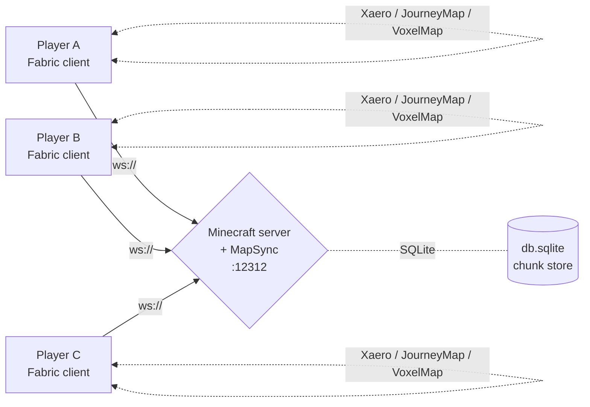

# MapSync

**Real-time terrain synchronization for Minecraft.**
See exactly what your friends see, as they explore it.

---

## What it does

Every time anyone with the mod loads a chunk in-game, MapSync hashes it and ships it to the sync server. The server stores it once (deduplicated by hash) and relays it to every other player currently connected. On the client, MapSync pipes received chunks into your map mod's tile cache — so areas your friends explore light up on **your** map in real time, even when you've never been there.

Compatible map mods:

|                       | Read  | Write | Notes                                                       |
| --------------------- | :---: | :---: | ----------------------------------------------------------- |
| **Xaero's World Map** |   yes |   yes | Region-granular `hasExistingChunkData` probe; first-class.  |
| **JourneyMap**        |   yes |   yes | Existence probe is a fail-safe placeholder until ported.    |
| **VoxelMap**          |   yes |   yes | Existence probe is a fail-safe placeholder until ported.    |
| *(no map mod)*        |   yes |    —  | Still ships your chunk data, just doesn't render incoming.  |

A per-chunk timestamp keeps order — older data never overwrites newer data, regardless of who saw it first.

---

## What's new in this fork

| Change                                | Why                                                                                            |
| ------------------------------------- | ---------------------------------------------------------------------------------------------- |
| **Single bundled jar**                | Same jar runs on client and server. No more standalone Node.js process or Docker container.    |
| **Auto-connect on join**              | Server pushes its ws address to clients via a Fabric custom payload. No GUI fiddling required. |
| **Preserve existing map data**        | First-contact safeguard: never overwrites pre-existing Xaero / JM / VoxelMap tiles silently.   |
| **Xaero mtime backfill**              | Seeds MapSync's timestamp index from Xaero's region cache on first install — friends' updates still flow through for areas you explored *before* installing MapSync. |
| **In-game `/mapsync` admin commands** | Whitelist + client management without leaving the game.                                        |
| **GUI progress lines**                | Tracked-chunk count and backfill phase visible in the MapSync settings screen.                 |

---

## Quick start

### Server side

1. Run a Fabric Minecraft server matching the jar's MC version (see jar filename — e.g. `MapSync-26.1.2.jar` targets MC 26.1.2).
2. Drop `MapSync-<version>.jar` and Fabric API into the server's `mods/` folder.
3. Start the server. MapSync creates `<world>/mapsync/` on first boot.
4. Forward `12312/tcp` to the server if players connect from outside your LAN.

### Client side

1. Drop the same `MapSync-<version>.jar` into your **Fabric client's** `mods/` folder, alongside Fabric API and your map mod (Xaero / JourneyMap / VoxelMap).
2. Join the Minecraft server normally — MapSync handshake runs automatically.
3. Press `,` (comma) at any time to open the MapSync GUI.

That's it. Operators on the MC server's whitelist or ops list are auto-imported into MapSync's whitelist — there's no second list to maintain.

> [!TIP]
> Run `/mapsync status` on the server to confirm the websocket is listening and clients are connecting.

---

## Operator commands

All commands require operator level 3 (`/op <player>` if needed):

| Command                                   | Purpose                                                                |
| ----------------------------------------- | ---------------------------------------------------------------------- |
| `/mapsync status`                         | Listening address, client count, whitelist size, data directory.       |
| `/mapsync whitelist list`                 | All whitelisted entries with cached IGNs.                              |
| `/mapsync whitelist add <uuid-or-ign>`    | Add to whitelist. IGNs only resolve for players who joined MC before.  |
| `/mapsync whitelist remove <uuid-or-ign>` | Remove from whitelist.                                                 |
| `/mapsync whitelist reload`               | Re-read `whitelist.json` and re-import MC's allowlist.                 |
| `/mapsync clients list`                   | Connected MapSync clients with auth state, dimension, game address.    |
| `/mapsync clients kick <id>`              | Close one MapSync connection.                                          |

See [docs/getting-started.md](docs/getting-started.md) for the full operator workflow, configuration reference, and migration notes from the standalone `mapsync-server`.

---

## Reporting issues

Issues live at [github.com/Pytonballoon810/map-sync/issues](https://github.com/Pytonballoon810/map-sync/issues). Two structured forms keep reports actionable:

- [**Report a bug**](https://github.com/Pytonballoon810/map-sync/issues/new?template=bug_report.yml) — for crashes, broken behavior, things that used to work, etc.
- [**Suggest a feature**](https://github.com/Pytonballoon810/map-sync/issues/new?template=feature_request.yml) — for new commands, GUI changes, protocol additions, quality-of-life improvements.

If your question doesn't fit either, [open a blank issue](https://github.com/Pytonballoon810/map-sync/issues/new) and tag it as you see fit.

---

## Compatibility

| Component              | Version                                                            |
| ---------------------- | ------------------------------------------------------------------ |
| Minecraft              | `26.1.2`                                                           |
| Loader                 | Fabric                                                             |
| Required mods          | Fabric API                                                         |
| Optional client mods   | Xaero's World Map / JourneyMap / VoxelMap (any combination)        |
| Java                   | 25 (`adoptium.net/temurin`)                                        |

The mod version tracks the targeted Minecraft version directly — `MapSync-26.1.2.jar` works against MC `26.1.2`.

---

## Acknowledgements

Forked from [CivPlatform/map-sync](https://github.com/CivPlatform/map-sync) by Gjum, Protonull, okx, Huskydog9988, specificlanguage, SirAlador, klaribot, Sheepy_9, and other contributors. The wire protocol, packet codecs, and chunk-extraction logic on the client side are upstream work. The bundling effort (in-mod websocket server, auto-discovery, safeguards, and Xaero backfill) is this fork's addition.

---

## License

GPL v3. See [LICENSE](LICENSE) for the full text. In short: you can use, modify, and redistribute this code under the same license, including for commercial purposes, but derived works must remain GPL v3.
