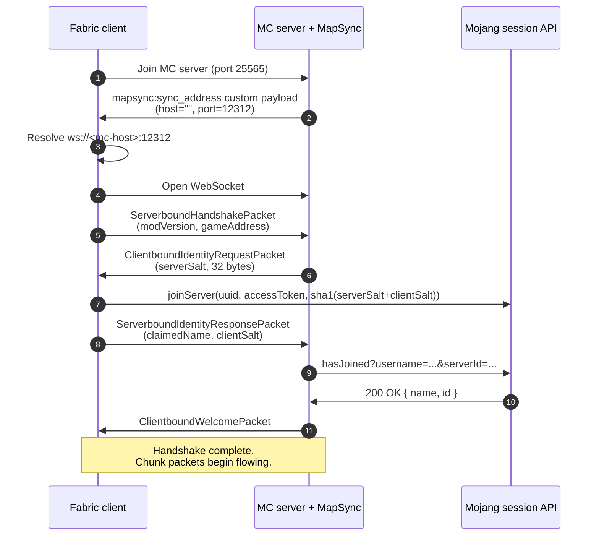

# Getting Started

Everything you need to install, configure, and troubleshoot MapSync on a Fabric server. The mod ships as **one jar** that handles both ends — there is no separate server binary, no Node.js, no Docker.

---

## Contents

1. [Install on the server](#install-on-the-server)
2. [Install on the client](#install-on-the-client)
3. [What happens on first connection](#what-happens-on-first-connection)
4. [Operator commands](#operator-commands)
5. [Configuration reference](#configuration-reference)
6. [Networking](#networking)
7. [Migrating from standalone mapsync-server](#migrating-from-standalone-mapsync-server)
8. [Troubleshooting](#troubleshooting)

---

## Install on the server

1. Run a **Fabric** Minecraft server matching the MapSync jar's MC version. Check the jar filename: `MapSync-26.1.2.jar` targets Minecraft `26.1.2`.
2. Install **Fabric API** in the server's `mods/` folder.
3. Drop the **same MapSync jar** in `mods/`.
4. Start the server. On first boot, MapSync creates `<world>/mapsync/`:

   ```
   <world>/mapsync/
   ├── config.json          ← see Configuration reference
   ├── whitelist.json       ← UUID allowlist; MC whitelist/ops auto-imported
   ├── uuid_cache.json      ← IGN → UUID, for /mapsync whitelist add <ign>
   ├── db.sqlite            ← deduplicated chunk store
   └── .xaero-backfilled    ← (per-client, not server-side) backfill marker
   ```
5. Confirm with `/mapsync status` — the line `websocket: listening on /0.0.0.0:12312` should appear.

---

## Install on the client

1. Install **Fabric loader** and **Fabric API**.
2. Install a map mod if you want incoming chunks rendered: **Xaero's World Map** (best supported), **JourneyMap**, or **VoxelMap**. Any combination works.
3. Drop the **same MapSync jar** in your client's `mods/` folder.
4. Launch the game and connect to the MC server normally. MapSync auto-handshakes.

> [!NOTE]
> You can still ship chunk data to the server without a map mod installed — you just won't see incoming chunks rendered on your end.

---

## What happens on first connection



If `auth: false` in `config.json`, the Mojang round-trip (steps 7–9) is skipped and an offline UUID derived from the player's claimed name is used instead.

---

## Operator commands

All commands require operator permission (`/op <player>` or `level: 3` in `ops.json`).

### Status

| Command            | Effect                                                                          |
| ------------------ | ------------------------------------------------------------------------------- |
| `/mapsync status`  | Listening address, connected client count, config flags, on-disk data dir path. |

Example output:

```
[MapSync] status
data dir: /opt/mc/world/mapsync
port: 12312
auth: true  whitelist: true
whitelist entries: 4
uuid cache entries: 12
websocket: listening on /0.0.0.0:12312  (2 connected)
```

### Whitelist

| Command                                   | Effect                                                                |
| ----------------------------------------- | --------------------------------------------------------------------- |
| `/mapsync whitelist list`                 | All entries with cached IGNs, sorted case-insensitively.              |
| `/mapsync whitelist add <uuid-or-ign>`    | Add. IGN only works if the player has joined the MC server before.    |
| `/mapsync whitelist remove <uuid-or-ign>` | Remove.                                                               |
| `/mapsync whitelist reload`               | Re-read `whitelist.json` from disk **and** re-import MC's allowlist.  |

> [!IMPORTANT]
> MC's `whitelist.json` and `ops.json` are folded into MapSync's whitelist automatically on server start and on every player join. You don't need to maintain two lists — just `/whitelist add` or `/op` a player normally and MapSync picks them up.

### Connected clients

| Command                       | Effect                                                                |
| ----------------------------- | --------------------------------------------------------------------- |
| `/mapsync clients list`       | One line per connection: id, auth state, dimension, game address.     |
| `/mapsync clients kick <id>`  | Close one connection. The client may auto-reconnect depending on config. |

---

## Configuration reference

File: `<world>/mapsync/config.json`

```json
{
  "host": "0.0.0.0",
  "port": 12312,
  "whitelist": true,
  "auth": true,
  "advertisedHost": ""
}
```

| Key              | Default     | Purpose                                                                                                                          |
| ---------------- | ----------- | -------------------------------------------------------------------------------------------------------------------------------- |
| `host`           | `0.0.0.0`   | Bind address for the websocket listener. `0.0.0.0` accepts from anywhere; `127.0.0.1` restricts to local.                       |
| `port`           | `12312`     | TCP port the websocket binds to. Forward this through your router/firewall when players connect from outside your LAN.          |
| `whitelist`      | `true`      | If `true`, only UUIDs in `whitelist.json` (or in MC's whitelist / ops) can connect. Recommended.                                |
| `auth`           | `true`      | If `true`, every connection goes through Mojang's `hasJoined` session check. Disable only for offline-mode servers.             |
| `advertisedHost` | `""` (empty)| Hostname the **client** should dial. Empty means "use the same hostname you used for the MC server." Override for proxy setups. |

A `config.json` edit takes effect on next server start — there is no in-game config reload yet.

---

## Networking

MapSync runs on a **separate TCP port** from Minecraft itself, so:

| Scenario                          | Port forwarding                                |
| --------------------------------- | ---------------------------------------------- |
| Server + players all on same LAN  | None.                                          |
| Players connect over the internet | Forward `12312/tcp` *in addition to* `25565/tcp`. |
| MapSync runs on a different port  | Forward your custom port instead of `12312`.   |
| Reverse proxy (nginx, Caddy, etc) | Proxy must support `Upgrade: websocket`.       |
| Cloudflare in front of the server | Cloudflare's free plan websocket support varies — check before relying. Set `advertisedHost` to your Cloudflare hostname. |

> [!TIP]
> Quick test from outside the LAN: `Test-NetConnection your.server.ip -Port 12312` (PowerShell) or `nc -zv your.server.ip 12312` (POSIX). If it connects, forwarding is good. If it times out, port forwarding or a firewall is in the way.

---

## Migrating from standalone mapsync-server

Existing standalone `mapsync-server` deployments can be moved over without losing chunk data:

1. Stop the standalone server.
2. Copy `db.sqlite`, `whitelist.json`, and `uuid_cache.json` from the standalone server's `data/` (or whatever `MAPSYNC_DATA_DIR` pointed at) into `<world>/mapsync/` on your Fabric MC server.
3. Drop the MapSync jar into the MC server's `mods/`.
4. Start the MC server. The on-disk formats are byte-compatible — no migration script needed.

The standalone server's `allowed-users.txt` / `denied-users.txt` format is **not** supported. Convert UUIDs into `whitelist.json` (a JSON array of UUID strings) before starting.

---

## Troubleshooting

### `/mapsync clients list` shows nothing connected

Check, in order:

1. **`/mapsync status` shows `websocket: listening`?** If not, the listener didn't start — look at server logs for `Failed to start MapSync websocket server`.
2. **Client can reach the port?** Run `Test-NetConnection <server-ip> -Port 12312` from the client machine. Time-out → port forwarding or firewall problem.
3. **You're on the MapSync whitelist?** Server-side: `/mapsync whitelist list`. Your UUID should be there. If not, `/mapsync whitelist add <your-ign>` (works once you've joined MC at least once).
4. **Client's auto-connect is on?** Open MapSync GUI (`,` keybind). The "Sync Server Addresses" field should show `ws://<server-host>:12312` (the auto-discovered address). The "Auto-connect" checkbox should be ticked. Default is on for fresh client configs.
5. **Client is using the new jar?** Stale builds without Phase 4 discovery won't auto-connect. Confirm filename matches your server.

### Server log shows `Failed to start MapSync websocket server: Address already in use`

Another process is bound to `12312`. Either stop the conflicting process (`ss -tlnp | grep 12312` on Linux to identify it) or change `port` in `config.json` and restart.

### Mojang auth fails for every connection

If clients connect but get kicked right after the handshake with `auth failed: ...`:

- **Mojang's session servers are reachable from the MC server?** Try `curl https://sessionserver.mojang.com/session/minecraft/hasJoined` from the host. A non-network error in the kick reason narrows it down.
- **Server time is correct?** A clock skew greater than a few minutes can trip Mojang's auth. `timedatectl status` (Linux) or sync NTP.
- **Server runs in offline mode?** Set `auth: false` in `config.json` to use offline UUIDs.

### My existing Xaero map data got overwritten

Shouldn't happen on a fresh install — the preserve-existing-map-data safeguard is on by default. If it did, you have either:

- Toggled off "Preserve existing map data" in the GUI at some point, or
- Walked through chunks (which marks them MapSync-known) before the Xaero backfill ran on a slow region cache.

Recovery is the same in both cases: restore the Xaero region files from a backup. If you don't have a backup, accept the sync-server's view going forward.

### The MapSync GUI shows `Xaero backfill: failed (...)`

The worker couldn't finish seeding chunkmeta from Xaero's region cache. Common causes:

- **Xaero region detection didn't complete within 2 minutes** — usually means a very large cache that needs more time. Restart the client; the worker retries on next `DimensionState` init.
- **Filesystem error** — check Minecraft's launcher log for the underlying exception.

Until the backfill succeeds, the safeguard runs in stricter mode: chunks Xaero has data for but MapSync hasn't seen are skipped. Walking through a chunk in-game still marks it MapSync-known.
